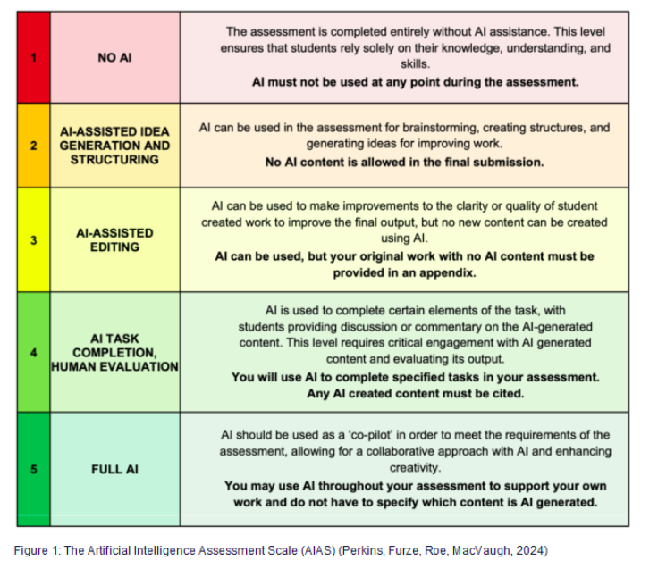
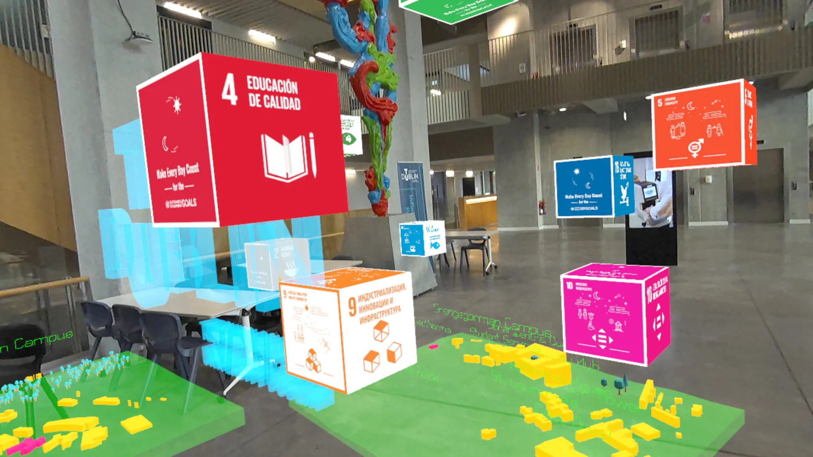

# eXtended Reality Prototyping Assignment 2024

This assignment is in category 4 for use of AI:

"Quest:SDG - Extended Reality for Sustainable Development"

For this assignment, you will create a short interactive experience inspired by the UN Sustainable Development Goals (SDGs). 

- **Extend Quest:SDG**: Add new features, goals, interactions, or systems to the existing project. For example, things that happen around the campus when the player activates one of the SDG's - Fork [this github repo](https://github.com/skooter500/questsdg)

- **Create a standalone experience**: Fork [this github repo](https://github.com/skooter500/xrp25). Its all the examples we are making this year.

You can use hand tracking or XR Toolkit and spatial audio, the META Scene SDK to interact with the real world. It can be a simulation, a game or interactive experience,  a visulisation, give the user some information or teach them something about the SDG's. It can be related to TU Dublin and you have the maps and models in Quest SDG so you can make things happen around the campus. 

Projects can be completed **individually or in teams of up to 3 students**.

## The 17 UN Sustainable Development Goals
1. No Poverty
2. Zero Hunger
3. Good Health and Well-being
4. Quality Education
5. Gender Equality
6. Clean Water and Sanitation
7. Affordable and Clean Energy
8. Decent Work and Economic Growth
9. Industry, Innovation and Infrastructure
10. Reduced Inequalities
11. Sustainable Cities and Communities
12. Responsible Consumption and Production
13. Climate Action
14. Life Below Water
15. Life on Land
16. Peace, Justice and Strong Institutions
17. Partnerships for the Goals

### Proposal (10% - Due 7th November)

Your proposal should include:

- Your project git repo URL
- Your idea in README.MD in the repo
- What technology and interaction libraries you are using
- Who is on your team

### Rubric

# Weighting

| Category | Weighting |
|-|-|
| Visuals & sound, Quality of outcome | 30%  |
| Technical Complexity | 30% |
| Project management & documentation | 30% |
| Proposal | 10% |

# Rubric

## Visuals & sound, Quality of outcome

| Grade | Indicative Aspects |
|-------|------------|
| 1     | Project is deployed to the Quest. It looks amazing with a high level of polish on the visuals. There is lots of functionality and interactivity - for example buttons to press, levers to turn, colors changing, movement, spatial sounds, animation etc. Use of visual effects such as particle systems, shaders to enhance visual quality. Has a clear visual style. Excellent use of the Meta Scene SDK, XR Toolkit or hand tracking. Has great sound effects. Closely aligned with the SDG's. I learned something new!  |
| 2.1 | Maybe deployed to the Quest but has some glitches or runs just on PC not in AR. Looks pretty good with decent but simple models. No visual effects. Sound effects grabbed from online sources. Some simple interactivity and button presses. Less coherent visual style. Well aligned with one of the SDG's |
| 2.2 |  One or two simple models imported from online sources. No interactivity, just an animated visual. Running in Godot. Little or no sound. Not so aligned with the SDG's |
| Pass | Model from online source or primitive that does not do anything |
| Fail | Does not compile or little or no content |
 
 ## Technical Implimentation 

 | Grade | Indicative Aspects |
 |-------|------------|
 | 1 | 15-20 hours work. A complete implementation that has lots of interactivity. Scenes and Subscenes used to manage assets. A good few self written scripts. Signals used correctly. Code separated into appropriate methods and classes, following [SOLID principles](https://www.digitalocean.com/community/conceptual-articles/s-o-l-i-d-the-first-five-principles-of-object-oriented-design). Code demonstrates techniques we have learned on the course including: Godot 3D  systems and Nodes. Transforms, Timers, Tweens, Physics, Materials, XR Toolkit, Meta Scene SDK, Hand Tracking, Procedural Generation. Demonstrated self directed learning. Mastry of Godot systems. Deployed and demoed on the quest on a phone.  Made a pull request to incorporate your work into one of the starter repos and was accepted |
 | 2.1 | 10-15 hours work. A less complex system that has interactivity. Several self written Scripts with other code included from tutorials and online sources. Long methods. Around 100 lines of self written GDScript, using some of the systems we learned on the course. Working on PC, maybe not VR. Good knowledge of Godot systems demonstrated |
 | 2.2 | 5-10 hours work. A simple system with a script or two based on modifying the transform or something very basic. Or most of the functionality is derived from tutorials with little customization or understanding. Little interactivity. Works in Godot, but not tested as a build or on device. No use of other Godot systems. No audio or inappropriate audio. Limited use of other Godot systems |
 | Pass | < 5 hours work. A single GDScript or scene or all from a tutorial. Compiles and runs |
| Fail | No submission or nothing works |

## Project Management & Documentation

| Grade | Indicative Aspects  |
|-------|------|
| 1 |  Clear initial proposal. 30-40 commits. Feature branches. For team projects, an equal distribution of the commits. Commits all commented. All sections of the template filled out. Document includes reflective elements - What did I learn? Sources properly referenced. Embedded, public, listed youtube video (DO NOT CHECK THIS VIDEO IS MADE FOR KIDS). The video demonstrates all the features of your project |
| 2.1 | 20-30 commits. One or two branches. All sections of the template filled out. Sources properly referenced. Issues with the video. 
| 2.2 |10-20 commits, terse or no comments. No branches. Documentation incomplete, Evidence of reflective learning missing. missing references. Issues with the video |
| Pass | < 10 commits. terse or no comments. No branches. Documentation incomplete. No video |

Examples from previous years:

- https://www.youtube.com/watch?v=FtxhKLheXAk&-list=PL1n0B6z4e_E6cRfAfzaoXDueW38ZAFsI9
- https://www.youtube.com/watch?v=ZkrQnQmDK-M&list=PL1n0B6z4e_E6LmwpeGIW7vYhesNYUOLEN
- [https://youtube.com/playlist?list=PL1n0B6z4e_E5naCKOJDfU-sgX_3CdlRfN](2020-2021)
- [https://youtube.com/playlist?list=PL1n0B6z4e_E6GaGOHiBdPSW0QzICdGs4X](2019-2020)
- [https://youtube.com/playlist?list=PL1n0B6z4e_E5qaYwUOlJ63XI2OR9ty7Bs](2018-2019)

1. Demo in class
   
2. Git Repository
   - Regular commits throughout development 
   - Include [all sections in this file](https://github.com/skooter500/csresources/blob/main/assignmentreadme.md)

## Resources
- Godot XR documentation: https://docs.godotengine.org/en/stable/tutorials/xr/
- UN SDG resources: https://sdgs.un.org/

